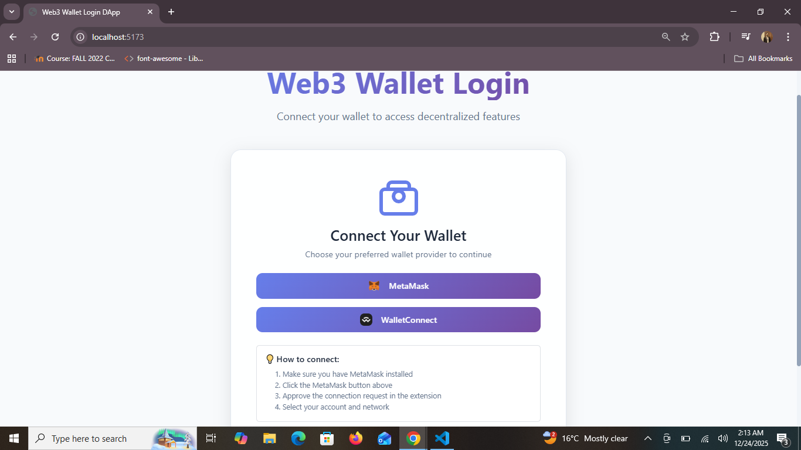
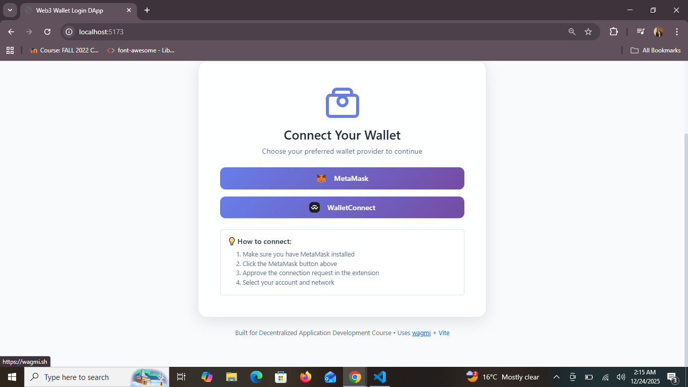
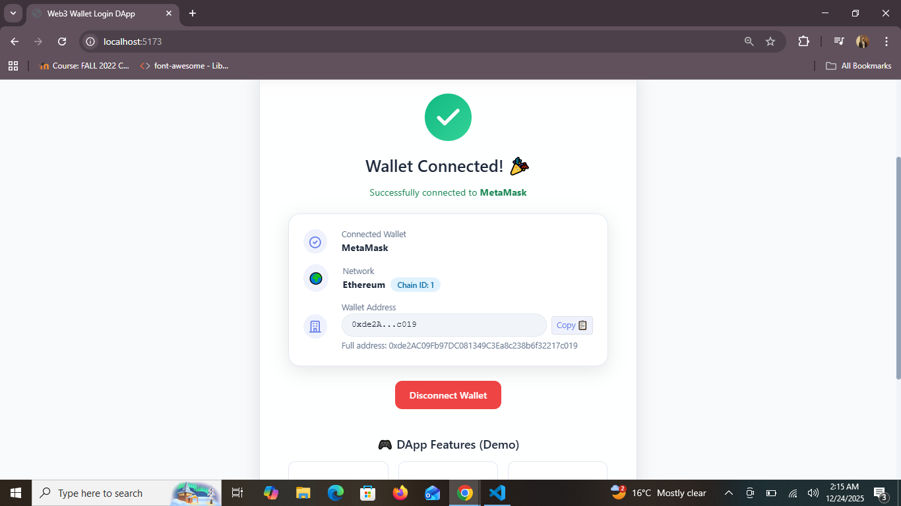
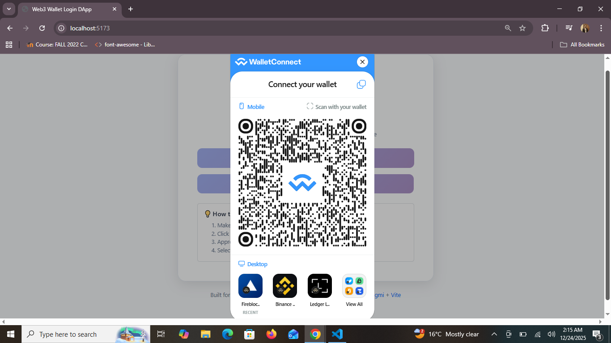
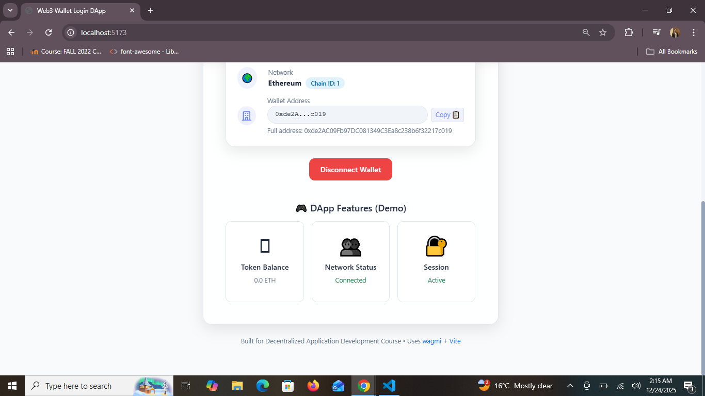

# Web3 Wallet Login DApp

A modern, responsive decentralized application for wallet authentication using MetaMask and WalletConnect.

## Features

- 🔐 **Multi-Wallet Support**: Connect with MetaMask or WalletConnect
- 🌐 **Network Detection**: Automatically detects connected network
- 📱 **Responsive Design**: Works on desktop and mobile
- 🎨 **Modern UI**: Glassmorphism design with gradients
- 📋 **Address Copy**: One-click copy wallet address
- 🔄 **Real-time Status**: Shows connection and network status

## Live Demo

https://web3-wallet-shariq.netlify.app/

## Screenshots

1. **Main Screen**
   

2. **Main2**
   

3. **MetaMask_login Screen**
   

4. **other wallet login Screen**
   

5. **Wallet Login**
   

## Prerequisites

- Node.js (v16 or higher)
- npm or yarn
- MetaMask browser extension (for MetaMask login)

## Installation

1. Clone the repository:
   ```bash
   git clone https://github.com/yourusername/web3-wallet-login-dapp.git
   cd web3-wallet-login-dapp